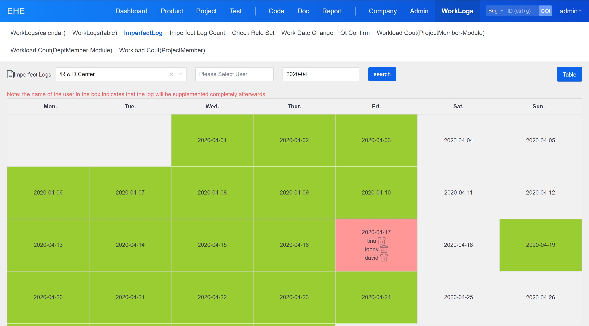
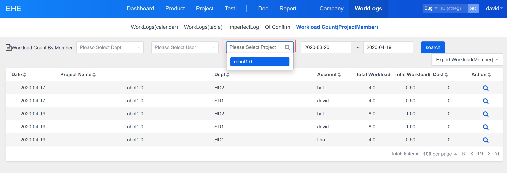

Table of Contents
=================

   * [Summary](#summary)
   * [Characteristic](#characteristic)
   * [Work log it maintainer](#work-log-it-maintainer)
      * [Set check rule](#set-check-rule)
      * [Reminder for filling in work log (automatically)](#reminder-for-filling-in-work-log-automatically)
      * [Incomplete registration of work log (automatic system)](#incomplete-registration-of-work-log-automatic-system)
      * [Handling log incomplete complaints](#handling-log-incomplete-complaints)
      * [Maintenance workday adjustment](#maintenance-workday-adjustment)
      * [Maintenance hours](#maintenance-hours)
      * [Maintain hourly and monthly salary](#maintain-hourly-and-monthly-salary)
      * [Permission settings](#permission-settings)
   * [Use of team members](#use-of-team-members)
      * [Fill in the work log](#fill-in-the-work-log)
      * [View work log and export](#view-work-log-and-export)
   * [Use of department managers](#use-of-department-managers)
      * [Assign tasks](#assign-tasks)
      * [View workload and HR expense statistics of department members](#view-workload-and-hr-expense-statistics-of-department-members)
      * [Overtime examination and approval](#overtime-examination-and-approval)
         * [Overtime time display](#overtime-time-display)
         * [Set overtime default approver](#set-overtime-default-approver)
         * [Overtime approval (afterwards)](#overtime-approval-afterwards)
         * [Overtime transfer to approval](#overtime-transfer-to-approval)
         * [Export overtime details (approved)](#export-overtime-details-approved)
   * [Use of Project Manager](#use-of-project-manager)
      * [View workload and labor cost statistics of project members](#view-workload-and-labor-cost-statistics-of-project-members)


# Summary

The scattered work log is of little significance and cannot be statistically analyzed; the investment in each link of R & D management is counted through the accurate classification of tasks and the time-consuming of timely filling in. This module mainly solves two problems: 1. Make sure that everyone has important tasks every day, and fill in the work time in time. 2. Accurately count the work cost of each project and classification.

The emphasis is on the filling of task processing, rather than the follow-up of post event logs. The former can be estimated, classified and counted; the latter can not be counted. Therefore, the work log of this module is the processing situation filled in when doing tasks. The system automatically generates the work log without recalling and registering.

# Characteristic

* compatible with Zen open source, professional and enterprise versions.
* installation and uninstallation do not affect the original functions of Zen path, including data. To achieve real seamless insertion.
* logs must be linked to work tasks. Project - > Task - > log. The log can be traced back to specific tasks. You can't fill in the log without a task. Instead, the project team is forced to manage its own tasks.
* Remind the urging team members to fill in the log. Do not fill in, remind; do not fill in, remind the team leader; do not fill in, register, configurable. Registration data your company can use for performance appraisal.
* overtime work (after work) review. Ensure that overtime work is real and audited.
* comprehensive statistics. Statistics workload by project, department and module, and can drill and export work details.
* The remaining work of each task can be calculated automatically.

# Work log it maintainer

## Set check rule

You can set the log of the specified user to be checked for filling integrity (users who do not add check rules will not be checked).

For the specified user,

1) The report superior can be set. Only one superior can be set

2) You can set whether to let the superior receive the email notice (this notice means that the email notice will be sent after the personal log is not filled in completely and automatically detected and registered)

3) This check rule can be enabled or disabled. Only after it is enabled can the system check the integrity of log filling and the system automatically sends email notification function


Batch addition or modification of inspection rules is supported (considering that the superiors of multiple persons are the same person, batch addition can reduce maintenance workload)


## Reminder for filling in work log (automatically)
1) At the appointed time of each working day, check that the log of the previous working day is complete. If it is incomplete (i.e. the workload is less than the company's specified working hours every day), send an email to remind and send it to individuals and their superiors (if it is not necessary to notify the superiors, select no notification in the "inspection rules"). The email format is as follows:
【PIC】

2) The detection time of incomplete log filling reminder can be configured. The default is 8:00 a.m. and 10:00 a.m. Adjust these two time points, as shown in the figure below. Click Edit to adjust the time.


## Incomplete registration of work log (automatic system)
1) At the appointed time of each working day, check whether the log of the previous working day is complete. If it is incomplete (i.e. the workload is less than the company's specified working hours every day), send an email to inform and register for warehousing.
You can view the people registered every day or export them.


Click to view the registration
【PIC】

2) The detection time of incomplete log filling registration can be configured. The default is 11 a.m. This time can be modified in the background system timing of Zen.
【PIC】

If you don't need email reminders, set this:
【link】

## Handling log incomplete complaints
The user may not be able to register the log because he / she asks for leave for compensatory leave / business trip. The administrator can cancel the registration.
Record the cancellation time, reason and operation.
【PIC】

## Maintenance workday adjustment
Adjust working days according to national holidays or company requirements.
You can set a specified date as a working day or a non working day.

If the original working days are adjusted to non working days, they will not check their work logs, because they can not work during the holiday~~


## Maintenance hours
Some companies have 8 hours, some 7.5 hours. It can be adjusted.
Modify the file and save it (without restarting the service). File: {installation directory} \ xampp \ zentao \ module \ myworklog \ config.php
```
$config->myworklog->workHourOnADay      = 8;
```

## Maintain hourly and monthly salary

Hourly / monthly salary is a very sensitive data. Whether it can be viewed in workload statistics requires setting permissions, as follows:


## Permission settings
Basically, permissions can be set for each operation of this module.
1. Ordinary employees have the following rights:

After they log in, the menu is like this

2. Department managers generally have the following authorities

After they log in, the menu is like this

3. The project manager generally opens the following authorities

After they log in, the menu is like this

Among them, there are several special authorities:
* viewing the work logs of all departments will affect the query of the log details in the "work log (table)". If you have this permission, all departments will be displayed here, indicating that you can view the log details of any department. Select "/" to query the details of all departments. If you do not have this permission, you can view all the person logs under this department by default.
【PIC】
Can I only read personal logs instead of others' logs? Yes, but not recommended (because the work of the team should be shared and supervised by everyone). In this way, modify the file: {installation directory} \ xampp \ zentao \ module \ myworklog \ config.php. Save (no need to restart the service). Changing false to true means that you can only read your own logs.
```
$config->myworklog->worklogview_onlyself      = false;
```

* Viewing the work logs of all projects will affect the statistics of projects under time consuming Statistics (project members module). If you do not specify this permission, you can only view the statistics of the workload of the project for which the project manager is the owner; if you specify this permission, you can count the workload of all projects


# Use of team members
## Fill in the work log
1. Workbench - my - to do tasks, click the "working hours" button on the right side of the list, and a form will pop up to fill in the work log.
2. After filling in, you can see the filled content in the work log - work log (calendar). If you have filled in enough working hours of the day, the grid is green, if not, it is red. Blue means the next working day, and there is no need to proofread.
3. If you want to support automatic calculation of remaining work, you need to install another plug-in. 【Link: install the task remaining work auto calculation plug-in】

## View work log and export
Work log - work log (table), you can export individual work log details.


# Use of department managers

## Assign tasks
Project task build task, set estimated working hours, assign processors.
The assigned person can see this task in the workbench - my - to-do task.
【PIC】

## View workload and HR expense statistics of department members
Work log - time consumption statistics (department member module)
Statistics of the workload invested by all members of the current user's department.
* if these members are involved in multiple projects, they can be further counted by project.
* it can even be counted by modules of the project layer by layer, which is very convenient.
* can drill down to work details and support export.
* you can view hourly and wage rates. But you need permission to view it.


## Overtime examination and approval
Management philosophy: overtime represents costs, which need to be controlled. The control methods include: overtime length exception reminder, overtime content approval. Overtime content is also the content of the work log. Overtime work can be generated when filling in the work log. The approval of the work log is the approval of overtime.
【PIC】

### Overtime time display
In the work calendar, displays the length of overtime.
If it is a working day: overtime hours = total working hours of the day - normal working hours of the working day.
If it is a non working day: overtime time = total working time of the day.


### Set overtime default approver
Configure the default approver (1 person) for overtime of team members in the inspection rule.
【PIC】

### Overtime approval (afterwards)
View daily overtime users in the form of calendar.
1. Display by calendar. For example, if there are 31 days in March, 31 squares will be displayed, each representing a day.
2. List the overtime users in the grid.
3. The approver shall approve the overtime work,
Fill in the following:
Factor: required, 0 \ 0.1 \ 0.2 \ 0.3 \ 0.4 \ 0.5 \ 0.6 \ 0.7 \ 0.8 \ 0.9 \ 1, default is 1.
Reason: optional.
The system automatically records the approver and approval time.
4. The approver can only approve the members that belong to his / her own approval.
5. The approved display is "checked [x \ y]", where x indicates the overtime hours agreed by the approver and Y indicates the overtime coefficient agreed by the approver. Click checked to open the approval details page: coefficient, reason, approver and approval time.
6. Unapproved users are marked in red. With permission, click the user name to open the approval page.
7. The approver can modify the approval. There is no date limit.
8. It can also be approved on the work log (calendar).


### Overtime transfer to approval
The approver can transfer to approval (only one person can be selected).
The transferred approver can be re approved.
The default approver and the last talent transferred to approval can approve.
For example, when a member is on a business trip and his work is likely to be more clear to the leader on site, the original reviewer can meet this special situation through re approval.


### Export overtime details (approved)
Export the approved overtime status of the specified month: date, account number, name, working day, work content, total working time (H), overtime before approval (H), overtime after approval (H), overtime coefficient after approval, reason, approval time and approval user.

# Use of Project Manager
The project manager's log management is basically the same as the Department Manager's, depending on how the company authorizes the project manager. The main differences, workload statistics, the focus of department managers and project managers are not the same.
Department managers pay attention to the input of their department members to each project and whether everyone's work is saturated;
The project manager only pays attention to the workload of the project members in his / her own charge, not the log details of his / her project, which he / she can't see. He can only see the workload of the project he is responsible for. As follows, the project leader sets the way.


## View workload and labor cost statistics of project members
Work log - time consumption statistics (project members - modules)
Statistics of the workload invested by project members.
* it can even be counted by modules of the project layer by layer, which is very convenient.
* can drill down to work details and support export.
* you can view hourly and wage rates. But you need permission to view it.


